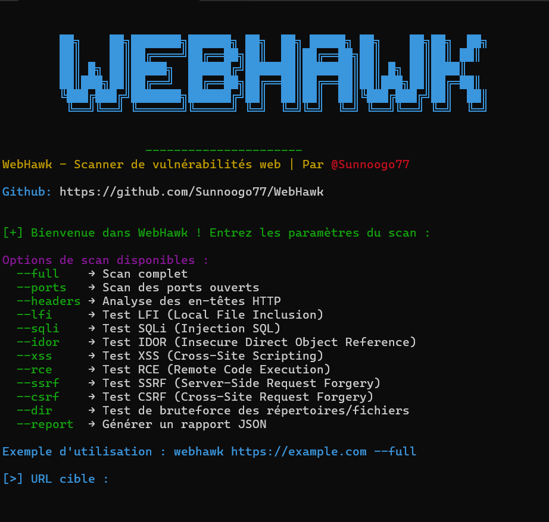

# **🦅 WebHawk - Scanner de Vulnérabilités Web**  
### **📡 Un outil éducatif pour apprendre et détecter les vulnérabilités web courantes !**  


---

## **📖 Introduction**
**WebHawk** est un scanner de sécurité web open-source conçu **à des fins éducatives** et destiné aux pentesteurs et développeurs souhaitant **comprendre et tester les vulnérabilités courantes** des applications web.  

🚀 **Fonctionnalités principales** :
- 📌 **Détection de 9 types de vulnérabilités web**  
- 🔍 **Mode interactif et mode CLI (Command Line Interface)**  
- ⚡ **Rapports de scan en JSON**  
- 🔄 **Conteneurisé avec Docker pour une exécution simplifiée**  

### **⚠️ Avertissement**
> **Cet outil est destiné à un usage éducatif uniquement**.  
> **N’utilisez WebHawk que sur des sites dont vous avez l’autorisation**.  

---

## **📂 Fonctionnalités et Vulnérabilités Détectées**
### **1️⃣ Port Scanner**
> **Description** : Scanne les **ports ouverts** sur une cible pour identifier les services en cours d’exécution (HTTP, SSH, MySQL, etc.).  
> **Pourquoi ?** : Un port ouvert peut **révéler des services vulnérables** s’ils ne sont pas sécurisés correctement.  

📌 **Commande d'exécution :**  
```sh
webhawk https://example.com --ports
```

---

### **2️⃣ Headers Security Scanner**
> **Description** : Analyse les **en-têtes HTTP** pour identifier les **mauvaises configurations** ou les en-têtes de sécurité manquants.  
> **Pourquoi ?** : Des **mauvais headers** peuvent exposer l’application à des attaques comme **Clickjacking**, **MIME Sniffing**, ou **MITM**.  

📌 **Commande d'exécution :**  
```sh
webhawk https://example.com --headers
```

---

### **3️⃣ SQL Injection (SQLi) Scanner**
> **Description** : Détecte les **injections SQL** via les **URL** et **formulaires**.  
> **Pourquoi ?** : Une injection SQL permet à un attaquant **d'exécuter des requêtes malveillantes** sur la base de données et d’accéder à des informations sensibles.  

📌 **Commande d'exécution :**  
```sh
webhawk https://example.com --sqli
```

---

### **4️⃣ Local File Inclusion (LFI) Scanner**
> **Description** : Détecte la vulnérabilité LFI qui permet de lire **des fichiers système** via un paramètre mal sécurisé.  
> **Pourquoi ?** : Peut être exploité pour lire des fichiers sensibles comme `/etc/passwd`.  

📌 **Commande d'exécution :**  
```sh
webhawk https://example.com --lfi
```

---

### **5️⃣ Cross-Site Scripting (XSS) Scanner**
> **Description** : Teste les vulnérabilités **XSS** dans les **URLs, formulaires et cookies**.  
> **Pourquoi ?** : Une faille XSS permet d’injecter du **JavaScript malveillant** dans le navigateur d’un utilisateur.  

📌 **Commande d'exécution :**  
```sh
webhawk https://example.com --xss
```

---

### **6️⃣ Insecure Direct Object Reference (IDOR) Scanner**
> **Description** : Vérifie si l'accès à certaines ressources est mal protégé, permettant de récupérer **des données non autorisées**.  
> **Pourquoi ?** : Une faille **IDOR** permet d'accéder aux comptes d'autres utilisateurs sans autorisation.  

📌 **Commande d'exécution :**  
```sh
webhawk https://example.com --idor
```

---

### **7️⃣ Cross-Site Request Forgery (CSRF) Scanner**
> **Description** : Vérifie si les requêtes sensibles sont protégées contre les **attaques CSRF**.  
> **Pourquoi ?** : Une faille CSRF permet **d’exécuter des actions à l’insu de l’utilisateur**.  

📌 **Commande d'exécution :**  
```sh
webhawk https://example.com --csrf
```

---

### **8️⃣ Server-Side Request Forgery (SSRF) Scanner**
> **Description** : Teste si le serveur peut être incité à faire des **requêtes vers d’autres systèmes internes**.  
> **Pourquoi ?** : Peut permettre un attaquant d’accéder à des ressources internes de l’entreprise.  

📌 **Commande d'exécution :**  
```sh
webhawk https://example.com --ssrf
```

---

### **9️⃣ Remote Code Execution (RCE) Scanner**
> **Description** : Vérifie si un site exécute **des commandes système non sécurisées**.  
> **Pourquoi ?** : Une vulnérabilité RCE permet **d’exécuter des commandes malveillantes** sur le serveur.  

📌 **Commande d'exécution :**  
```sh
webhawk https://example.com --rce
```

---

### **🔟 Directory & File Scanner**
> **Description** : Recherche **des fichiers et répertoires cachés** sur le serveur.  
> **Pourquoi ?** : Peut révéler des fichiers **sensibles** comme `config.php`, `backup.zip`, ou `.env`.  

📌 **Commande d'exécution :**  
```sh
webhawk https://example.com --dirs
```

---

## **📦 Installation et Exécution**
### **🔧 Installation via Docker**
WebHawk est conteneurisé pour simplifier son utilisation.  
📌 **Commande pour exécuter WebHawk avec Docker :**
```sh
docker run --rm -it webhawk https://example.com --full
```

---

### **🔧 Installation Manuelle**
📌 **1️⃣ Cloner le dépôt GitHub**
```sh
git clone https://github.com/Sunnoogo77/WebHawk.git
cd WebHawk
```
📌 **2️⃣ Installer les dépendances**
```sh
pip install -r requirements.txt
```
📌 **3️⃣ Lancer WebHawk**
```sh
python3 main.py https://example.com --full
```

---

## **📑 Mode Interactif**
Vous pouvez aussi lancer **WebHawk en mode interactif** :  
```sh
webhawk
```
🌟 **Exemple d'affichage :**
```


        ██╗    ██╗███████╗██████╗ ██╗  ██╗ █████╗ ██╗    ██╗██╗  ██╗
        ██║    ██║██╔════╝██╔══██╗██║  ██║██╔══██╗██║    ██║██║ ██║
        ██║ █╗ ██║█████╗  ██████╔╝███████║███████║██║ █╗ ██║████║
        ██║███╗██║██╔══╝  ██╔══██╗██╔══██║██╔══██║██║███╗██║██╔═██║
        ╚███╔███╔╝███████╗██████╔╝██║  ██║██║  ██║╚███╔███╔╝██║  ██║
         ╚══╝╚══╝ ╚══════╝╚═════╝ ╚═╝  ╚═╝╚═╝  ╚═╝ ╚══╝╚══╝ ╚═╝  ╚═╝


                    ----------------------
WebHawk - Scanner de vulnérabilités web | Par @Sunnoogo77

Github: https://github.com/Sunnoogo77/WebHawk


[+] Cible détectée : https://example.com
```

---

## **📜 Licence**
Ce projet est sous **licence MIT**.  
Utilisation autorisée à des **fins éducatives uniquement**. **Ne pas utiliser pour des actions illégales !** 🚫


---

## **🎯 Conclusion**
WebHawk est **un outil éducatif puissant** qui permet d’apprendre les vulnérabilités web tout en pratiquant.  
🔥 **Testez votre propre site et améliorez sa sécurité !** 🚀
